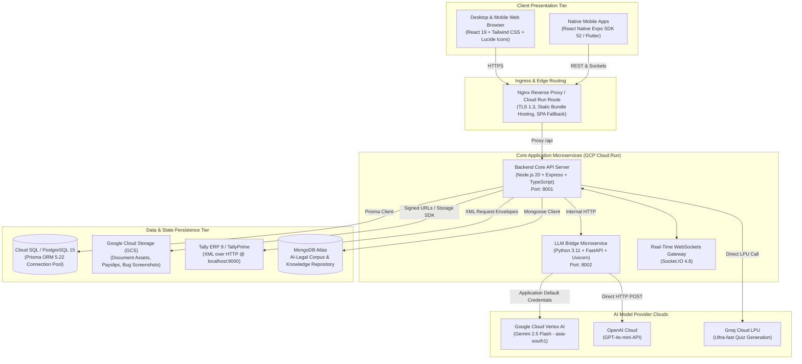

# 🏗️ Convee Education — System Architecture & Technology Stack

## Overview

Convee Education is an enterprise-grade digital campus operating system designed for educational institutions ranging from K-12 schools to national universities. It is architected as a distributed serverless microservice application deployed on Google Cloud Run.

---

## 1. High-Level Architecture Diagram

---

## 2. Component Deep Dive

### 2.1 Web Frontend (`/frontend`)
- **Technology**: React 19, Tailwind CSS 3, Vite / CRACO build system.
- **UI Architecture**: Standardized design tokens adhering to `@shadcn/ui` conventions, `lucide-react` iconography, `recharts` for academic and financial analytics, and `date-fns` for timetable scheduling.
- **Portals Included**:
  - **SuperAdmin Portal**: Cross-institution metrics, organization provisioning, AI token billing telemetry, bug triage.
  - **Admin / Registrar Portal**: User enrollment, ID card generation, academic promotions, department/team configuration.
  - **Accountant Portal**: Student fee ledgers, staff payroll, expense tracking, bank accounts, society funds, cash registers, fixed assets, and Tally XML import/export.
  - **Teacher Classroom Hub**: Attendance roster marking, homework assignment, rubric grading, timetable view.
  - **Student Portal**: Daily adaptive quizzes (Study Buddy), homework submissions, fee status, report card download.
  - **Parent Portal**: Multi-child context switcher, real-time attendance, fee dues, report cards, teacher communication.
  - **Collaboration Pages**: Real-time channel chat, direct messages, kanban task boards, video meeting manager.

### 2.2 Core Backend REST API (`/backend`)
- **Technology**: Node.js 20 LTS, Express 4.21, TypeScript 5.6.
- **ORM & Data Layer**: Prisma ORM 5.22 targeting PostgreSQL 15.
- **Real-Time Layer**: Socket.IO 4.8 managing persistent connections with rooms partitioned by `orgId`, `channelId`, and `userId`.
- **Security & Privacy**:
  - Helmet with custom CSP.
  - CASA Tier-2 audit logger (`logsCreator`) redacting passwords, session tokens, and Aadhaar numbers.
  - Classroom-friendly rate limiters keying by `${ip}:${email}` to prevent false lockouts on shared school Wi-Fi networks.
  - Strict anti-caching headers on all authenticated API endpoints.

### 2.3 LLM Bridge AI Microservice (`/llm_bridge`)
- **Technology**: Python 3.11, FastAPI 0.115, Uvicorn, Google GenAI SDK.
- **Role**: Dispatches AI prompts based on persona:
  - **Students, Parents, Alumni**: Routed to **Google Cloud Vertex AI (Gemini 2.5 Flash)** in the `asia-south1` region for high throughput and context efficiency.
  - **Faculty, Staff, Leadership**: Routed to **OpenAI GPT-4o-mini** for administrative and lesson-planning tasks.
- **Failover**: Automatic bidirectional fallback between Vertex AI and OpenAI if either provider experiences upstream degradation.

### 2.4 Mobile Applications (`/mobile` & `/mobile-flutter`)
- **Primary Mobile App (`/mobile`)**: React Native built on Expo SDK 52 with TypeScript. Supports standalone Android `.apk` builds and iOS simulator packages via EAS Build.
- **Alternative Mobile Client (`/mobile-flutter`)**: Native Flutter 3 implementation using Provider architecture and Material 3 design.

---

## 3. Storage & Integration Infrastructure

| Subsystem | Technology | Configuration & Details |
| :--- | :--- | :--- |
| **Relational Database** | PostgreSQL 15 | Managed Cloud SQL in production; connection pooling via Prisma Client; 36 schema models. |
| **Object Storage** | Google Cloud Storage (GCS) | Private buckets with HMAC signed URLs (24h expiry) for documents, payslips, and bug screenshots. |
| **Accounting Integration**| Tally ERP 9 / TallyPrime | Communicates with local Tally instances via XML over HTTP on port 9000; two-way ledger sync. |
| **Document Knowledge** | MongoDB Atlas | Stores parsed statutory bare acts, case law judgments, and PYQ mock test banks. |
