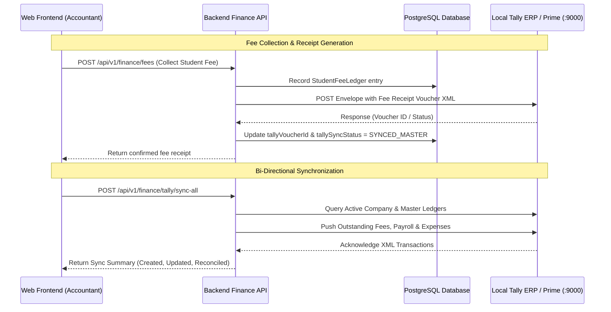

# ⚙️ Convee Education — Functional Modules & Operational Workflows

This document outlines the core business workflows and functional engines operating across the platform.

---

## 1. Academic Operations & Timetable Management

The timetable engine manages the weekly distribution of periods, classes, and teachers.

- **Slot Definitions**: Standardized 8 periods per day, Monday through Saturday.
- **Conflict Avoidance**: Prevents assigning the same faculty member or room to multiple overlapping slots.
- **Automated Proxy Teacher Assignment**:
  1. A teacher records a planned or sick leave (`TeacherAbsence`).
  2. The system scans the timetable for affected slots.
  3. The HOD or Dean accesses `/api/v1/timetable/proxies/available` to view teachers who have a free period during that exact slot.
  4. The HOD allocates a substitute teacher (`ProxyAssignment`).
  5. The substitute teacher receives an automated real-time notification with class section and subject details.

---

## 2. Examinations, Assessments & Automated Report Cards

A unified grading pipeline from examination scheduling to certified report cards:

1. **Exam Configuration**: Admins configure an `Exam` session specifying academic session (e.g. `2026-2027`), terms, target classes, and grading mode (Numerical 0–100 or Letter Grade A+ to F).
2. **Subject Allocation**: Each exam incorporates multiple `ExamSubject` records with defined maximum and passing marks, supporting theory and practical/lab components.
3. **Score Entry**: Subject teachers enter marks, absence flags, and individual observations for each student.
4. **Report Card Compilation**:
   - Aggregates overall marks, percentage, and passing status.
   - Embeds attendance statistics from `AttendanceRecord` (total sessions vs. attended sessions).
   - Ingests AI-synthesized qualitative feedback highlighting strengths and improvement areas.
   - Embeds multi-tier digital signatures (Class Teacher, HOD, Principal) and the official institution seal.
   - Published report cards are instantly accessible on Student and Parent portals.

---

## 3. Homework & Rubric-Based Grading

1. **Assignment Creation**: Teachers publish assignments linked to class sections with deadlines and syllabus attachments.
2. **Student Submission**: Students submit rich text responses and upload PDFs/images via Google Cloud Storage.
3. **Grading**: Teachers evaluate submissions using structured rubrics, assigning numerical scores and qualitative notes.
4. **State Machine**: Tracks assignments across `PENDING` ➔ `ACCEPTED` ➔ `EXTENSION_REQUESTED` ➔ `SUBMITTED` ➔ `COMPLETED`.

---

## 4. Adaptive AI Study Buddy & Daily Quizzes

A gamified pedagogical loop to reinforce daily retention:

- **Personalized Generation**: Generates 5-question daily quizzes tailored to the student's current grade level and subjects.
- **Dynamic Skill Tiers**: Adjusts student `skillScore` (0–100) across 4 proficiency levels: `BEGINNER`, `INTERMEDIATE`, `ADVANCED`, and `MASTERY`.
- **Habit Formation**: Tracks daily streaks and celebrates consistency.
- **Pedagogical Feedback**: Provides detailed explanations for every question, explaining why an answer is correct or incorrect.

---

## 5. Real-Time Communication & Collaboration

- **Channel Types**: `PUBLIC`, `PRIVATE`, `DIRECT`, `TEAM`, `DEPARTMENT`, `PROJECT`, `ANNOUNCEMENT`.
- **Interactivity**: Emoji reactions, threaded replies (`parentId`), pinned messages, and real-time read receipts (`MessageRead`).
- **AI Channel Summarizer**: Summarizes up to 100 recent unread channel messages into concise action items and key decisions.

---

## 6. Parent Portal & Guardian Oversight

- **Multi-Child Switcher**: Parents with multiple enrolled children can switch between children seamlessly via `ParentStudentLink`.
- **Academic Telemetry**: Real-time attendance percentage, today's attendance status, overdue homework alerts, and weekly timetable schedules.
- **Fee Transparency**: Outstanding tuition balances, payment due dates, and downloaded fee receipts.

---

## 7. Academic Promotion & Batch Archiving

- **Progression Mapping**: Configured via `AcademicPromotionConfig` (e.g., Grade 9 ➔ Grade 10, Grade 12 ➔ Alumni Group).
- **Batch Archiving**: Preserves historical class states, student rosters, and academic records in `AcademicBatchArchive` as structured JSON snapshots.
- **Alumni Transition**: Graduated seniors are automatically migrated into designated `AlumniGroup` channels.

---

## 8. Institutional Finance & Tally ERP 9 / Prime Sync

A dedicated financial module built for Indian institutional accounting standards:

- **Student Fee Ledgers**: Statuses: `PAID`, `PENDING`, `PARTIAL`, `OVERDUE`. Generates Tally Receipt Vouchers under Sundry Debtors.
- **Staff Payroll**: Monthly salary calculation, basic pay, allowances, deductions (PF/ESI/TDS), and payslips. Syncs with Tally as Salary Payable (Sundry Creditors).
- **Institutional Expenses**: Categories include Maintenance, Utilities, Lab Equipment, and IT.
- **Society & Trust Funds**: Tracks Capital Corpus, Infrastructure Grants, and Scholarship Endowments.
- **Cash Registers**: Multi-desk cash registers (Admissions, Petty Cash, Principal Office) with daily cash-in/out vouchers.
- **Fixed Asset Depreciation**: Catalogs capital assets and calculates straight-line or Written Down Value (WDV) depreciation.
- **Tally Tombstones**: Deletions in Convee create a `TallyTombstone` entry to reconcile deletions in Tally on the next sync cycle.

---

## 9. Legal Education & Judicial / ADP Aspirant Suite

Designed for National Law Universities and judicial exam aspirants (Civil Judge PCS-J, HJS, and Public Prosecutor ADP):

- **Automated Bare Act Scraping**: Ingests and indexes acts from India Code and Supreme Court eSCR.
- **AI Judicial Study Assistant**: Month-by-month study blueprint generator tailored to specific state syllabi (Delhi, UP, MP, Bihar, Rajasthan).
- **Mains Answer Evaluation**: Evaluates subjective answers against legal rubrics, section citations, landmark precedents, and judgment writing standards.
- **Previous Year Question (PYQ) Bank**: Searchable repository of state judicial service papers.

---

## 10. In-App Bug & Crash Reporting

- Captures browser metadata, operating system, URL, and console stack traces.
- Automatically uploads screenshots to Google Cloud Storage with private signed URLs.
- Superadmins triage bug reports by severity (`LOW`, `MEDIUM`, `HIGH`, `CRITICAL`) and resolution status (`OPEN`, `IN_PROGRESS`, `RESOLVED`, `CLOSED`).
