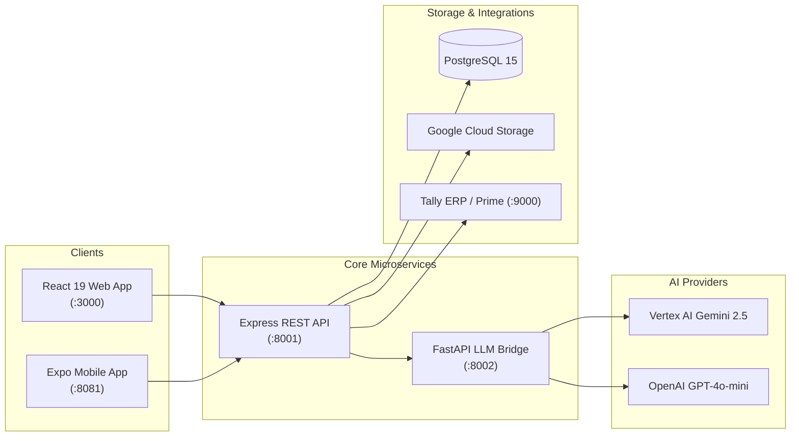

# 📚 Convee Education — Documentation Hub

Welcome to the central documentation library for the **Convee AI Education Platform**. This directory contains modular, exhaustive documentation covering every subsystem, architectural layer, database entity, API route, security policy, and deployment workflow.

---

## 📑 Documentation Index

| File | Subject | Description |
| :--- | :--- | :--- |
| [**00_MASTER_SYSTEM_ARCHITECTURE.md**](./00_MASTER_SYSTEM_ARCHITECTURE.md) | **Master Reference** | The complete end-to-end monolithic reference guide covering all topics in one file. |
| [**01_ARCHITECTURE_AND_TECH_STACK.md**](./01_ARCHITECTURE_AND_TECH_STACK.md) | **System Architecture** | Microservices topology, React 19 web app, Node 20 backend, Python 3.11 LLM Bridge, and mobile apps. |
| [**02_CAMPUS_HIERARCHY_AND_RBAC.md**](./02_CAMPUS_HIERARCHY_AND_RBAC.md) | **Tenancy & RBAC** | Multi-tenant organization structure, 11 institutional roles, and dynamic JSON role permissions. |
| [**03_FUNCTIONAL_MODULES_AND_WORKFLOWS.md**](./03_FUNCTIONAL_MODULES_AND_WORKFLOWS.md) | **Functional Modules** | Timetables & proxy allocation, exams & report cards, homework, adaptive quizzes, chat, and Tally sync. |
| [**04_AI_ARCHITECTURE_AND_GUARDRAILS.md**](./04_AI_ARCHITECTURE_AND_GUARDRAILS.md) | **AI & Safety** | Dual-LLM routing (Vertex AI vs OpenAI), 5-tier safety guardrails, crisis cards, and token cost tracking. |
| [**05_DATABASE_SCHEMA_AND_MODELS.md**](./05_DATABASE_SCHEMA_AND_MODELS.md) | **Database & Prisma** | Relational schema diagrams and catalog of all 36 Prisma ORM models and relationships. |
| [**06_REST_API_REFERENCE.md**](./06_REST_API_REFERENCE.md) | **REST API Catalog** | Complete inventory and parameter specifications for all 21 Express API controllers at `/api/v1`. |
| [**07_SECURITY_PRIVACY_AND_CASA.md**](./07_SECURITY_PRIVACY_AND_CASA.md) | **Security & Compliance**| CASA Tier-2 compliance, anti-BOLA/IDOR protection, classroom rate limiting, and audit logging. |
| [**08_ENVIRONMENT_CONFIGURATION.md**](./08_ENVIRONMENT_CONFIGURATION.md) | **Environment Config** | Master `.env` dictionary for Backend, LLM Bridge microservice, and Web Frontend. |
| [**09_DEVELOPMENT_AND_TESTING_GUIDE.md**](./09_DEVELOPMENT_AND_TESTING_GUIDE.md) | **Dev & Testing** | Local setup instructions, PowerShell launcher (`run.ps1`), functional tests, and security crash suites. |
| [**10_CLOUD_DEPLOYMENT_GUIDE.md**](./10_CLOUD_DEPLOYMENT_GUIDE.md) | **Cloud & Production** | Automated Google Cloud Run deployment, Cloud SQL (Postgres), and Cloud Storage (GCS). |
| [**11_INSTITUTIONS_AND_CREDENTIALS.md**](./11_INSTITUTIONS_AND_CREDENTIALS.md) | **Institutions Directory**| Seeded user directory and test credentials for CNLU, Aryabhata Institute, and Tagore International. |
| [**12_COMMANDS_CHEAT_SHEET.md**](./12_COMMANDS_CHEAT_SHEET.md) | **Commands Cheat-Sheet**| Quick copy-paste commands for building, running, and deploying every component. |

---

## ⚡ Quick System Overview

